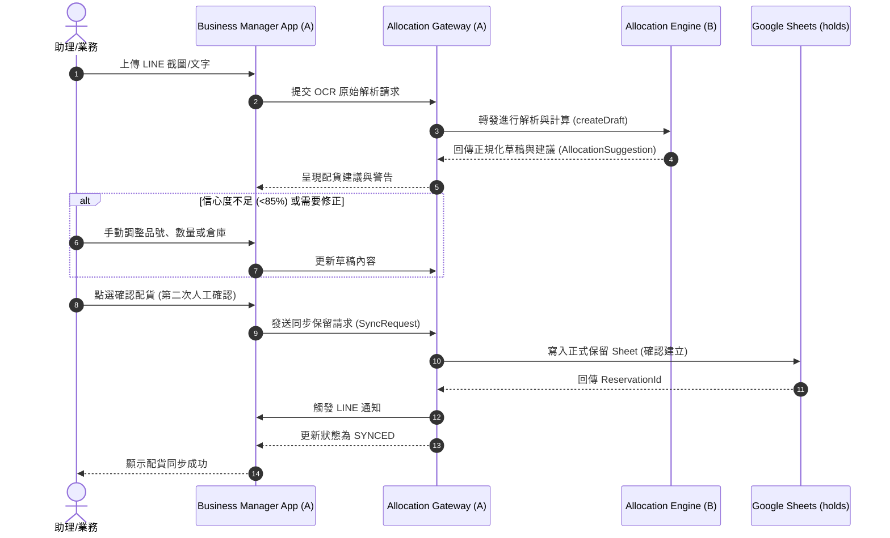

# JYAI Allocation Assistant - FLOW

## 1. 系統交互流程圖 (Mermaid Diagram)

## 2. 步驟說明

### 步驟 1：匯入配貨草稿 (Ingestion)
* **輸入**: LINE 機器人 doPost 接收之使用者上傳圖片或文字。
* **處理**: `AllocationGateway` 調用 `createDraft`，暫存於配貨資料庫中，此時狀態為 `DRAFT`。

### 步驟 2：解析與正規化 (OCR & Normalization)
* **處理**: `AllocationEngine` 解析文字：
  * 當信心評分分數 >= 85% 時，直接進階到庫存分析。
  * 當信心分數 < 85% 時，將狀態標示為 `OCR_REVIEW`，將資料退回前端要求助理介入。

### 步驟 3：配貨分析 (Allocation Analysis)
* **處理**: `AllocationEngine` 載入庫存快照 `InventorySnapshot`：
  * 優先比對「單一倉庫」、「小量剩餘批號」等配貨商業規則。
  * 產出 `AllocationSuggestion` 與相關警告（例如庫存不足、必須混批等），狀態轉換為 `ALLOCATION_REVIEW`。

### 步驟 4：人工第二次確認 (Human-in-the-loop Review)
* **處理**: 前端 UI 呈現配貨明細：
  * 一般助理有權修改選定的倉庫、批號或分配數量。
  * 助理點選「確認建立」，系統對草稿進行防重鍵計算（Idempotency Key），狀態更新為 `ALLOCATION_CONFIRMED`。

### 步驟 5：寫入與同步 (Sync to Sheets)
* **處理**: `AllocationGateway` 調用正式業務管家 API 將配貨同步至 Google Sheets，成功後將狀態更新為 `SYNCED`；發送 LINE 提醒訊息給對應之業務與主管。
